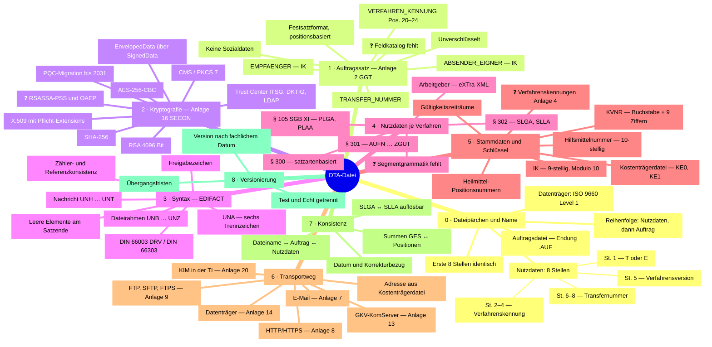

# Mindmap: Technische Anforderungen an eine DTA-Datei

Diese Seite fasst **alle technischen Anforderungen an eine DTA-Datei** aus der
Wissensbibliothek zu einer Übersicht zusammen. Sie ist bewusst redundant zu den
Detailseiten — sie ersetzt sie nicht, sondern dient als Einstieg und als Checkliste.

**Lesehilfe**

| Marker | Bedeutung |
|---|---|
| ✅ | Aus Gesetzestext oder Dokument-Metadaten belegt |
| ⚠️ | Sekundärquelle — Primärdokument nicht gelesen |
| ❓ | Unvollständig/widersprüchlich — **vor Implementierung zwingend verifizieren** |

Jeder Zweig verweist auf die zugehörigen Anforderungen (`REQ-*`,
[Anforderungskatalog](../50-anforderungen/01-anforderungskatalog.md)) und Prüfregeln
(`S0-…`–`S6-…`, [Validierungsregeln](../50-anforderungen/02-validierungsregeln.md)).

---

## 1. Die Mindmap



## 2. Kompaktansicht als Baum

```
DTA-Datei
├── 0  Dateipärchen und Name ......... KKS / Anlage 1 GGT ......... S0-*  REQ-TRANS-01/02
│     ERBA0123  +  ERBA0123.AUF
│     └ T|E · Verfahrenskennung · Version · Transfernummer
├── 1  Auftragssatz .................. Anlage 2 GGT ............... S1-*  REQ-TRANS-03/04/07
│     Festsatz, unverschlüsselt, ohne Sozialdaten
├── 2  Kryptografie .................. Anlage 16 GGT / SECON ...... S2-*  REQ-SEC-01…07
│     EnvelopedData( SignedData( Nutzdaten ) )
├── 3  Syntax und Zeichensatz ........ EDIFACT .................... S3-*  REQ-SYN-01…07
│     UNA · UNB … UNZ · DIN 66003/66303
├── 4  Nutzdaten je Verfahren ........ Sektor-TA .................. S3-/S4-<verf>  REQ-VERF-*
│     SLGA/SLLA · PLGA/PLAA · AUFN…ZGUT · Satzarten · XML
├── 5  Stammdaten und Schlüssel ...... IK · KVNR · KTR · Kataloge . S4-*  REQ-STAMM-01…08
├── 6  Transportweg .................. GGT-Anlagen 7/8/9/13/14/20 . S0-ALL-009  REQ-TRANS-06/08
├── 7  Konsistenz und Summen ......... verfahrensübergreifend ..... S5-*/S6-*  REQ-PLAUS-*
└── 8  Versionierung und Stichtage ... Regelwerks-Registry ........ REQ-FACH-02/03/04
```

---

## 3. Zweig 0 — Dateipärchen und Namenskonvention

Quelle: [KKS, Auftragsdatei, Dateinamen](02-kks-auftragsdatei-dateinamen.md) ⚠️ [Q7][Q14w]

| Anforderung | Beleg | Regel |
|---|---|---|
| Übertragung besteht aus **genau zwei Dateien**: Nutzdatendatei (verschlüsselt) und Auftragsdatei (unverschlüsselt) | ⚠️ [Q14w] | `S0-ALL-001` |
| Reihenfolge: erst Nutzdatendatei, **danach** Auftragsdatei | ⚠️ [Q14w] | — |
| Nutzdatendateiname ist **8 Stellen** lang: `T`/`E` + 3-stellige Verfahrenskennung + Version + 3-stellige Transfernummer | ⚠️ [Q7] | `S0-ALL-004`…`007` |
| Auftragsdatei = dieselben 8 Stellen + Endung **`.AUF`** | ⚠️ [Q7] | `S0-ALL-002/003` |
| Endung der Nutzdatendatei wird **ignoriert** | ⚠️ [Q7] | — |
| Bei Datenträgerversand: keine Unterverzeichnisse, Namen nach ISO 9660 Level 1 | ⚠️ [Q21] | `S0-ALL-009` |

## 4. Zweig 1 — Auftragssatz

Quelle: [KKS, Auftragsdatei, Dateinamen — Abschnitt 2](02-kks-auftragsdatei-dateinamen.md) ⚠️ [Q7]

| Anforderung | Beleg | Regel |
|---|---|---|
| Positionsbasiertes **Festsatzformat**, logisch in Objekte gegliedert, physisch ein zusammenhängender Satz | ⚠️ [Q7] | `S1-ALL-001` |
| Bleibt **unverschlüsselt**, damit die Annahmestelle vor der Entschlüsselung routen kann | ⚠️ [Q7] | — |
| Enthält **keine Sozialdaten** (Trennungsgebot) | ⚠️ | `S1-ALL-008`, REQ-TRANS-07 |
| `VERFAHREN_KENNUNG` auf **Position 20–24**, Werteliste aus Anlage 4 GGT | ⚠️ [Q20] | `S1-ALL-002/003` |
| `ABSENDER_EIGNER` und `EMPFAENGER` sind gültige IK | ⚠️ [Q7] | `S1-ALL-004/005/006` |
| `TRANSFER_NUMMER` korrespondiert mit den Stellen 6–8 des Dateinamens | ⚠️ [Q7] | `S1-ALL-007` |

> ❓ **Blocker:** Gesamtlänge, vollständige Feldliste, Positionen, Längen, Datentypen und
> Pflichtfeldkennzeichnung sind nur aus **Anlage 2 GGT** zu übernehmen. Ohne sie ist
> Stufe 1 nicht implementierbar.

## 5. Zweig 2 — Kryptografie (SECON)

Quelle: [Security-Schnittstelle SECON](05-security-secon.md) ⚠️ [Q8][Q27]

| Anforderung | Vorgabe | Beleg | Regel |
|---|---|---|---|
| Container | CMS / PKCS#7 | ⚠️ [Q8] | `S2-ALL-001` |
| Schachtelung | äußerer ContentType `EnvelopedData`, innerer `SignedData` — **erst signieren, dann verschlüsseln** | ⚠️ [Q8] | `S2-ALL-002/003` |
| Inhaltsverschlüsselung | AES, 256 Bit, CBC | ⚠️ [Q8] | `S2-ALL-004` |
| Hashfunktion | SHA-256 | ⚠️ [Q8] | `S2-ALL-005` |
| RSA-Schlüssellänge | 4096 Bit (Teilnehmer und Interchange Key) | ⚠️ [Q8] | `S2-ALL-006` |
| Migrationsverfahren | RSASSA-PSS, RSAES-OAEP | ❓ Verbindlichkeit offen [Q27] | `S2-ALL-013` |
| Zertifikate | X.509 in ASN.1; Extensions `SubjectKeyIdentifier`, `AuthorityKeyIdentifier`, `KeyUsage`, `CertificatePolicies`, `SubjectAlternativeName`, `BasicConstraints`, `CRLDistributionPoints` | ⚠️ [Q8] | `S2-ALL-008`…`011` |
| Schlüsselverwaltung | eigener Keystore für den privaten Schlüssel, LDAP für öffentliche Schlüssel | ⚠️ [Q8] | REQ-SEC-06/07 |
| Trust Center | ITSG, DKTIG | ⚠️ [Q13][Q13b] | `S2-ALL-009` |
| Zukunft | BSI TR-02102, hybride PQC-Verfahren (ML-KEM), klassische Verfahren nur bis Ende 2031 | ⚠️ [Q38] | REQ-SEC-05 |

## 6. Zweig 3 — Syntax und Zeichensatz

Quelle: [EDIFACT-Syntax und Zeichensatz](03-edifact-syntax-und-zeichensatz.md) ⚠️ [Q1]

| Anforderung | Beleg | Regel |
|---|---|---|
| `UNA` beginnt mit den Großbuchstaben `UNA`, unmittelbar gefolgt von **sechs** Trennzeichen; im UNA-Segment selbst keine Trennzeichen | ⚠️ [Q1] | `S3-ALL-001` |
| Trennzeichen werden **aus dem UNA-Segment gelesen**, nicht hartkodiert | ⚠️ [Q1] | REQ-SYN-01 |
| Datei läuft von `UNB` bis `UNZ`; Nachrichten von `UNH` bis `UNT` | ⚠️ [Q1] | `S3-ALL-002` |
| Zähler und Referenznummern stimmen: `UNZ` ↔ Nachrichtenzahl, `UNT` ↔ Segmentzahl, `UNB`/`UNZ` und `UNH`/`UNT` paarweise | — | `S3-ALL-003/004/005` |
| Nicht gefüllte Datenelemente **am Segmentende dürfen entfallen** | ⚠️ [Q1] | REQ-SYN-05 |
| Freigabe-/Escape-Zeichen korrekt behandeln | ⚠️ [Q1] | `S3-ALL-007` |
| Zeichensatz § 301: DIN 66303:2000-06 (8-Bit) bzw. DIN 66003 DRV (7-Bit); dort ersetzen `[ \ ] { \| } ~` die Umlaute | ⚠️ [Q1] | `S3-ALL-006`, REQ-SYN-03 |

> ❓ Ob die Verfahren die EDIFACT-**Default**-Trennzeichen verwenden, ist **nicht** belegt
> und je Technischer Anlage zu verifizieren. Der zulässige Zeichensatz für
> §§ 300/302 SGB V und § 105 SGB XI ist ebenfalls offen — die § 301-Vorgabe darf **nicht**
> übertragen werden.

## 7. Zweig 4 — Nutzdaten-Struktur je Verfahren

Quelle: [Verfahrensübersicht](../20-verfahren/00-verfahrensuebersicht.md),
[`data/nachrichtentypen.yaml`](../data/nachrichtentypen.yaml)

| Verfahren | Nachrichtentypen | Format | Beleg |
|---|---|---|---|
| § 302 SGB V — Sonstige Leistungserbringer | `SLGA`, `SLLA` | EDIFACT-nah | ⚠️ [Q1] |
| § 105 SGB XI — Pflege | `PLGA`, `PLAA` | EDIFACT-nah | ✅ [Q22] |
| § 301 SGB V — Krankenhaus | `AUFN`, `KOUB`, `VERL`, `ANFM`, `MBEG`, `ENTL`, `RECH`, `ZAHL`, `AMBO`, `ZAAO`, `SAMU`, `FEHL`, `ZGUT` | EDIFACT-nah | ⚠️ [Q30] |
| § 300 SGB V — Apotheken | satzartenbasiert | eigenes Satzformat | ⚠️ [Q6] |
| Arbeitgeber / Zahlstellen | eXTra-Meldungen | XML | ⚠️ [Q17] |

Typische Dateistruktur § 302 ⚠️ [Q1]: `UNB` → (`SLGA` `SLLA`)* → `UNZ`.

> ❓ Segmentreihenfolge, Kardinalitäten und Feldkataloge je Nachrichtentyp sind
> **nicht belegt** — sie stammen zwingend aus der jeweiligen sektorspezifischen
> Technischen Anlage. Ohne sie sind die Prüfstufen 3–6 nicht implementierbar.

## 8. Zweig 5 — Stammdaten und Schlüssel

Quelle: [40-stammdaten/](../40-stammdaten/)

| Element | Formale Anforderung | Beleg | Regel |
|---|---|---|---|
| **IK** | 9-stellig numerisch; Stellen 1–2 Klassifikation, 3–4 Regionalbereich, 5–8 Seriennummer, 9 Prüfziffer; Modulo 10 über die Stellen 3–8 | ⚠️ [Q9], Algorithmus ❓ | `S4-ALL-001` |
| **KVNR** | Unveränderbarer Teil: 1 Großbuchstabe + 8 Ziffern + Prüfziffer; vollständige Form 10 + 9 IK + 1 = 20 Stellen | ⚠️ [Q10w], ❓ | `S4-ALL-002` |
| **Kostenträgerdatei** | Amtliches Verzeichnis der Daten- und Belegannahmestellen; Ausgabestände `KE0`, `KE1`, …; je Sektor getrennt | ⚠️ [Q15], Satzstruktur ❓ | `S1-ALL-006` |
| **Verfahrenskennungen** | Werteliste aus Anlage 4 GGT, gültig ab 01.01.2026 | ✅ [Q20], Werteliste ❓ | `S0-ALL-005`, `S1-ALL-002` |
| **Hilfsmittelpositionsnummer** | 10-stellig; Ersatzregel: 7-stellige Produktart + `9` + `00` | ⚠️ [Q24] | `S4-302-002` |
| **Heilmittelpositionsnummern** | Positionsnummernverzeichnisse des GKV-SV | ⚠️ [Q24] | `S4-302-003` |
| **Alle Schlüsseltabellen** | gültigkeitszeitraumbezogen (`gueltig_ab` / `gueltig_bis`), Auswahl nach fachlichem Datum | ⚠️ [Q1] | `S4-302-004`, REQ-STAMM-06 |

## 9. Zweig 6 — Transportweg

Quelle: [Transportwege](04-transportwege.md)

| Weg | Anlage | Harte technische Vorgabe | Beleg |
|---|---|---|---|
| E-Mail | 7 | Genau **eine** Nutzdaten- und **eine** Auftragsdatei je Mail; mehrere Anhänge unzulässig; Betriebsnummer oder IK in der Betreffzeile | ⚠️ [Q16] |
| HTTP/HTTPS | 8 | ❓ TLS-Versionen, Cipher-Suites, Clientauthentifizierung nicht recherchiert | ⚠️ [Q12] |
| FTP / SFTP / FTPS | 9 | ❓ Verzeichnisstruktur und Quittungsmechanik nicht recherchiert | ⚠️ [Q12] |
| GKV-Kommunikationsserver | 13 | eXTra-XML über gehaltene HTTPS-Verbindung; Authentifizierung per TLS-Clientzertifikat; Serverzertifikat muss geprüft werden | ⚠️ [Q17] |
| Physische Datenträger | 14 | DVD-R/DVD+R, 12 cm, DVD 5 (max. 4,7 GB), UDF, Dateinamen nach ISO 9660 Level 1, keine Unterverzeichnisse | ⚠️ [Q21] |
| KIM in der TI | 20 | CMS/CAdES **Enveloping**; nur **eine** Nutzdatendatei je Nachricht; Dateiname in der Betreffzeile | ⚠️ [Q18] |

Der zulässige Weg und die konkrete Zieladresse stehen in der **Kostenträgerdatei**
des Sektors ⚠️ [Q15].

## 10. Zweig 7 — Querschnitt Konsistenz

| Anforderung | Regel |
|---|---|
| Verfahrenskennung im Dateinamen = `VERFAHREN_KENNUNG` im Auftragssatz | `S1-ALL-003` ❓ |
| Transfernummer im Dateinamen = `TRANSFER_NUMMER` im Auftragssatz | `S1-ALL-007` ❓ |
| Test-/Echt-Kennzeichen konsistent über Dateiname, Auftragssatz und Nutzdaten | REQ-TRANS-05 ❓ |
| Absender-IK im Auftragssatz = Absender-IK in den Nutzdaten (`FKT`) | `S5-ALL-001` ❓ |
| Empfängerzertifikat gehört zum IK der adressierten Datenannahmestelle | `S2-ALL-012` |
| Gesamtbetrag `GES` = Summe der Positionsbeträge; Positionsbetrag = Menge × Einzelpreis | `S5-302-003/004` |
| Zu jeder `SLGA` existiert mindestens eine zugehörige `SLLA` mit auflösbarem Rechnungsbezug | `S5-302-001/002` |
| Leistungsdatum ≤ Rechnungsdatum ≤ Erstellungsdatum der Datei | `S6-ALL-001/002` |
| Korrekturrechnung hat gültigen Bezug zur Ursprungsrechnung | `S6-302-001` |

## 11. Zweig 8 — Querschnitt Versionierung

| Anforderung | Beleg |
|---|---|
| Die anzuwendende Regelwerksversion richtet sich nach dem **fachlich maßgeblichen Datum** (Leistungsdatum / Abrechnungsmonat / Datenlieferungsquartal), **nicht** nach dem Systemdatum | REQ-FACH-02 ✅ |
| Übergangsfristen erlauben **zwei parallel gültige Versionen** — z. B. § 302 Anlage 3 V21/V22 bis 30.04.2027 | REQ-FACH-03 ⚠️ [Q1] |
| Test- und Echtbetrieb werden unterschieden und im Ergebnis gekennzeichnet | REQ-FACH-04 ⚠️ |
| Jedes Prüfergebnis nennt die angewandte Regelwerksversion und die Fundstelle | REQ-FACH-06 |

---

## 12. Was diese Mindmap noch nicht beantworten kann

Die vier Knoten, an denen die technische Spezifikation heute abbricht — in der
Reihenfolge ihrer Dringlichkeit:

| # | Lücke | Blockiert | Quelle beschaffen |
|---|---|---|---|
| 1 | Feldkatalog des **Auftragssatzes** (Positionen, Längen, Typen, Pflichtfelder, Gesamtlänge) | Prüfstufe 1 vollständig | Anlage 2 GGT [Q7] |
| 2 | Werteliste der **Verfahrenskennungen** | `S0-ALL-005`, `S1-ALL-002/003` | Anlage 4 GGT [Q20] |
| 3 | **Segmentgrammatik und Feldkataloge** je Nachrichtentyp | Prüfstufen 3–6 | Sektor-TA, z. B. § 302 Anlagen 1 + 3 [Q1] |
| 4 | **Satzartenstruktur der Kostenträgerdatei** | alle Routing-Prüfungen | Kostenträgerdateien je Sektor [Q15] |

Ergänzend zu verifizieren: IK-Prüfziffernalgorithmus [Q9], KVNR-Prüfziffer inkl.
Buchstabenbehandlung [Q10], Verbindlichkeit von RSASSA-PSS/OAEP [Q27], zulässiger
Zeichensatz je Verfahren [Q1].

→ Vollständige Beschaffungsliste:
[Roadmap und offene Punkte](../60-projekt/02-roadmap-und-offene-punkte.md)

## 13. Weiterführend

- [GGT und ihre Anlagen](01-ggt-und-anlagen.md)
- [KKS, Auftragsdatei, Dateinamenskonvention](02-kks-auftragsdatei-dateinamen.md)
- [EDIFACT-Syntax und Zeichensatz](03-edifact-syntax-und-zeichensatz.md)
- [Transportwege](04-transportwege.md)
- [Security-Schnittstelle SECON](05-security-secon.md)
- [Anforderungskatalog](../50-anforderungen/01-anforderungskatalog.md)
- [Validierungsregeln — Prüfstufenmodell](../50-anforderungen/02-validierungsregeln.md)
- [Quellenverzeichnis](../00-ueberblick/03-quellenverzeichnis.md)
